# TaskForge

TaskForge is a collaborative full-stack project management platform built for CodeAlpha Full Stack Development Task 3. It combines a PostgreSQL-backed Django REST API with a responsive HTML, CSS, and vanilla JavaScript client.

## 1. Project Overview

TaskForge lets teams create shared projects, manage project roles, assign work, move task cards through a Kanban workflow, discuss tasks, and receive live notifications. Backend permission checks are the security boundary; hidden frontend controls are only a usability aid.

## 2. CodeAlpha Requirements

| Requirement | Status |
|---|---|
| Group projects and membership | Complete |
| Task creation and assignment | Complete |
| Task comments and communication | Complete |
| Full-stack JWT authentication | Complete |
| Project boards and task cards | Complete |
| User/project/task/comment administration | Complete |
| Notifications bonus | Complete |
| Django Channels WebSocket bonus | Complete and tested |

## 3. SDLC Methodology

The project followed an incremental Agile workflow:

1. Requirements and acceptance criteria were recorded in `docs/`.
2. Roles, relationships, constraints, endpoints, and permission rules were designed.
3. Authentication, projects, tasks, comments, frontend, and real-time work were developed on focused branches.
4. Each backend phase received validation and authorization tests.
5. Features were integrated through the REST API and WebSocket events.
6. System checks, migration checks, automated tests, JavaScript syntax checks, security scans, and responsive browser checks were run.
7. Documentation was updated to describe only implemented behavior.

## 4. User Stories

- A visitor can register, log in, refresh a JWT, and manage their own profile.
- An owner can create a project and manage its members and roles.
- A manager can create, assign, update, move, and delete tasks.
- A member can view shared work and update the status of a task assigned to them.
- A project member can read and create task comments.
- A comment author can edit or delete their comment; owners/managers can moderate deletion.
- A user can view and mark notifications and receive new ones live.
- A project member can see board changes without manually refreshing.

Detailed acceptance criteria are in `docs/user-stories.md`.

## 5. Features

- Custom Django user with unique email, avatar, bio, and safe profile updates
- JWT registration, login, refresh, and protected requests
- Owner, manager, and member project roles
- Project membership by username or email
- Task priority, assignee, due date, status, position, filters, and overdue state
- To Do, In Progress, and Done Kanban columns
- Native drag-and-drop plus accessible status selectors
- Task discussion with 2,000-character validation
- Notification inbox, unread count, mark-read, and mark-all-read
- Dashboard counts and recent work
- Responsive login, registration, dashboard, projects, board, task detail, and profile pages
- Django admin for users, projects, memberships, tasks, comments, and notifications
- Secure JWT-authenticated WebSockets using first-message authentication

## 6. User Roles and Permissions

| Action | Owner | Manager | Member |
|---|---:|---:|---:|
| View project, members, tasks, comments | Yes | Yes | Yes |
| Edit/delete project | Yes | No | No |
| Add/remove members or change roles | Yes | No | No |
| Create/assign/edit/delete tasks | Yes | Yes | No |
| Change any task status | Yes | Yes | No |
| Change assigned task status | Yes | Yes | Yes |
| Add comments | Yes | Yes | Yes |
| Edit own comment | Yes | Yes | Yes |
| Delete own comment | Yes | Yes | Yes |
| Moderate comment deletion | Yes | Yes | No |

An owner membership cannot be removed or downgraded through normal membership endpoints.

## 7. Technology Stack

- Python 3.12
- Django 6.0.6 and Django REST Framework 3.17.1
- PostgreSQL with Psycopg 3
- Simple JWT 5.5.1
- Django Channels 4.3.2 and Daphne 4.2.2
- In-memory channel layer for local development
- HTML5, CSS3, and vanilla JavaScript

No frontend framework, CSS framework, Firebase, or Node.js backend is used.

## 8. Database Design

```text
User 1---* Project (owner)
User *---* Project (through ProjectMember.role)
Project 1---* Task
User 1---* Task (creator)
User 1---* Task (optional assignee)
Task 1---* Comment
User 1---* Comment
User 1---* Notification (recipient)
```

Foreign keys, unique membership constraints, one-owner constraints, protected project ownership, and safe cascading relationships keep data consistent. See `docs/database-design.md`.

## 9. Project Structure

```text
accounts/       custom user, JWT authentication, profile API
projects/       projects, membership, roles, dashboard, board consumer
tasks/          task workflow, assignment, filtering, permissions
comments/       task discussion and comment permissions
notifications/  notification API, service, broadcasts, consumer
config/         settings, URLs, ASGI/WSGI, WebSocket routing
frontend/       static HTML, CSS, and vanilla JavaScript client
tests/          collaboration and WebSocket integration tests
docs/           requirements, design, API, and testing documents
```

## 10. Installation

Windows PowerShell:

```powershell
cd "D:\Vs Studio\CodeAlpha_ProjectManagementTool"
py -3.12 -m venv .venv
Set-ExecutionPolicy -Scope Process -ExecutionPolicy Bypass
.\.venv\Scripts\Activate.ps1
python -m pip install --upgrade pip
python -m pip install -r requirements.txt
Copy-Item .env.example .env
```

Select `.venv\Scripts\python.exe` with VS Code's **Python: Select Interpreter** command. Edit `.env` with local values and never commit it.

## 11. PostgreSQL Setup

In pgAdmin:

1. Expand **Servers** and connect to the local PostgreSQL server.
2. Right-click **Databases**, then select **Create > Database**.
3. Set the database name to `taskforge`.
4. Select the PostgreSQL user configured in `.env` as owner.
5. Save, then confirm the new database appears under **Databases**.

Equivalent administrator SQL:

```sql
CREATE DATABASE taskforge;
```

Use the password that was set during PostgreSQL installation or changed in pgAdmin. Put it only in `POSTGRES_PASSWORD` inside `.env`.

## 12. Environment Variables

```dotenv
DJANGO_SECRET_KEY=replace-with-a-long-random-secret-key
DJANGO_DEBUG=True
DJANGO_ALLOWED_HOSTS=localhost,127.0.0.1

POSTGRES_DB=taskforge
POSTGRES_USER=postgres
POSTGRES_PASSWORD=replace-with-your-postgres-password
POSTGRES_HOST=localhost
POSTGRES_PORT=5432

CORS_ALLOWED_ORIGINS=http://127.0.0.1:5500,http://localhost:5500
```

Generate a development secret locally:

```powershell
python -c "from django.core.management.utils import get_random_secret_key; print(get_random_secret_key())"
```

## 13. Migrations

```powershell
python manage.py check
python manage.py makemigrations --check --dry-run
python manage.py migrate
```

Expected current output includes `System check identified no issues`, `No changes detected`, and either applied migrations or `No migrations to apply`.

## 14. Running Backend

With the virtual environment active:

```powershell
python manage.py runserver 127.0.0.1:8000
```

Daphne's Channels-aware `runserver` serves HTTP and WebSocket traffic. Open:

- Health API: `http://127.0.0.1:8000/api/health/`
- Admin: `http://127.0.0.1:8000/admin/`

Create an administrator when required:

```powershell
python manage.py createsuperuser
```

## 15. Running Frontend

TaskForge uses one clear static-client setup (Option B). In a second PowerShell terminal:

```powershell
cd "D:\Vs Studio\CodeAlpha_ProjectManagementTool"
.\.venv\Scripts\Activate.ps1
python -m http.server 5500 --bind 127.0.0.1 --directory .
```

Open `http://127.0.0.1:5500/`. The root entry redirects to the correct page under `frontend/pages/`; do not append a second path manually. Keep both terminal servers running. The frontend calls the API and WebSockets at `127.0.0.1:8000`.

Legacy `/pages/*.html` bookmarks remain supported and redirect to the canonical `/frontend/pages/*.html` routes while preserving query parameters.

## 16. API Endpoints

| Method | Path | Permission |
|---|---|---|
| GET | `/api/health/` | Public |
| POST | `/api/auth/register/` | Public |
| POST | `/api/auth/login/` | Public |
| POST | `/api/auth/token/refresh/` | Public |
| GET, PATCH | `/api/auth/me/` | Authenticated user |
| DELETE | `/api/auth/me/avatar/` | Authenticated user |
| GET, POST | `/api/projects/` | Authenticated; creator becomes owner |
| GET | `/api/projects/{id}/` | Project member |
| PATCH, DELETE | `/api/projects/{id}/` | Owner |
| GET | `/api/projects/{id}/members/` | Project member |
| POST | `/api/projects/{id}/members/` | Owner |
| PATCH, DELETE | `/api/projects/{id}/members/{member_id}/` | Owner; owner protected |
| GET, POST | `/api/projects/{id}/labels/` | Project member to read; owner or manager to create |
| GET | `/api/projects/{id}/activities/` | Project member |
| PATCH, DELETE | `/api/project-labels/{id}/` | Owner or manager |
| GET | `/api/projects/{id}/tasks/` | Project member |
| POST | `/api/projects/{id}/tasks/` | Owner or manager |
| GET | `/api/tasks/{id}/` | Project member |
| PATCH, DELETE | `/api/tasks/{id}/` | Owner or manager |
| PATCH | `/api/tasks/{id}/status/` | Owner, manager, or assignee |
| PATCH | `/api/tasks/{id}/assign/` | Owner or manager |
| PATCH | `/api/tasks/{id}/position/` | Owner or manager |
| PATCH | `/api/tasks/{id}/complete/` | Owner, manager, or assignee |
| PATCH | `/api/tasks/{id}/reopen/` | Owner, manager, or assignee |
| PATCH | `/api/tasks/{id}/labels/` | Owner or manager |
| GET, POST | `/api/tasks/{id}/attachments/` | Project member |
| GET | `/api/task-attachments/{id}/download/` | Project member |
| DELETE | `/api/task-attachments/{id}/` | Uploader, owner, or manager |
| GET, POST | `/api/tasks/{id}/checklists/` | Project member to read; owner or manager to create |
| DELETE | `/api/checklists/{id}/` | Owner or manager |
| POST | `/api/checklists/{id}/items/` | Owner, manager, or assignee |
| PATCH, DELETE | `/api/checklist-items/{id}/` | Owner, manager, or assignee |
| PATCH | `/api/checklist-items/{id}/toggle/` | Owner, manager, or assignee |
| GET, POST | `/api/tasks/{id}/comments/` | Project member |
| PATCH | `/api/comments/{id}/` | Comment author |
| DELETE | `/api/comments/{id}/` | Author, owner, or manager |
| GET | `/api/notifications/` | Authenticated recipient |
| PATCH | `/api/notifications/{id}/read/` | Authenticated recipient |
| PATCH | `/api/notifications/read-all/` | Authenticated recipient |
| GET | `/api/dashboard/` | Authenticated user |
| GET | `/api/search/?q={query}` | Authenticated; returns authorized projects and tasks only |

Use `Authorization: Bearer <access-token>` for protected APIs. Task list filters are `status`, `priority`, `assigned_to`, and `overdue=true|false`. See `docs/api-documentation.md` for request details.

## 17. WebSocket Events

| Route | Access | Events |
|---|---|---|
| `/ws/projects/{project_id}/board/` | Project member | `task_created`, `task_updated`, `task_deleted`, `task_status_changed`, `comment_created`, `member_added`, `attachment_added`, `attachment_deleted`, `checklist_updated` |
| `/ws/notifications/` | Authenticated user, own group only | `notification_created` |

The server first sends:

```json
{"type": "authentication_required"}
```

The client responds over the open socket, not in the URL:

```json
{"type": "authenticate", "token": "<access-token>"}
```

Invalid tokens close with code `4401`; unauthorized project access closes with `4403`. The in-memory layer is appropriate for one local process only; production deployment should use a shared channel layer such as Redis.

## 18. Testing

```powershell
python manage.py check
python manage.py makemigrations --check --dry-run
python manage.py migrate
python manage.py test
```

Frontend syntax check when Node.js is available:

```powershell
Get-ChildItem frontend\js\*.js | ForEach-Object { node --check $_.FullName }
```

Manual flows are tracked in `docs/testing-checklist.md`.

Latest full verification (`python manage.py test --keepdb`):

```text
Found 79 test(s).
Ran 79 tests in 352.409s
OK
System check identified no issues (0 silenced).
```

`--keepdb` safely reuses the isolated `test_taskforge` database and does not access
or reset the live `taskforge` data.

## 19. Security

- `.env`, virtual environments, media, caches, logs, database dumps, and runtime files are ignored.
- Passwords are hashed and never returned.
- JWT protects every private REST endpoint.
- Querysets hide unrelated project data.
- Backend permissions prevent role elevation, non-member assignment, unauthorized edits, and comment ownership violations.
- Serializer validation does not trust browser values.
- Frontend user text is rendered with `textContent`/DOM nodes; unsafe `innerHTML` is not used.
- JWT APIs use authorization headers rather than cookie authentication, so normal CSRF tokens are not used for API calls. Django admin still uses session authentication and CSRF protection.
- WebSocket access tokens are sent as the first socket message, never in URLs or logs.
- Multi-record project creation and notification/broadcast work use transaction-aware behavior.

## 20. Screenshots

Review screenshots are stored in `docs/screenshots/`:

The workspace captures below use the existing Ali Khan review account and real project data.

### Workspace

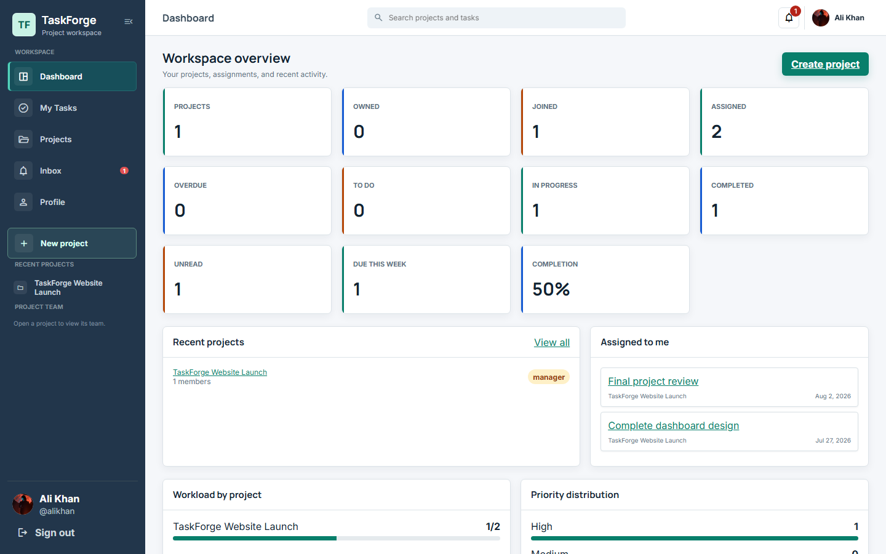

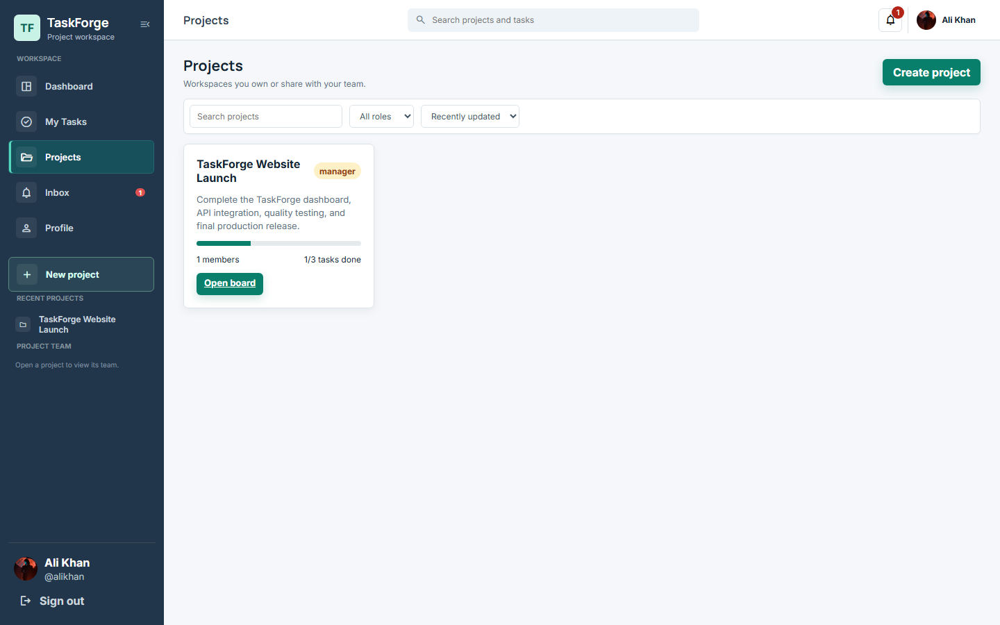

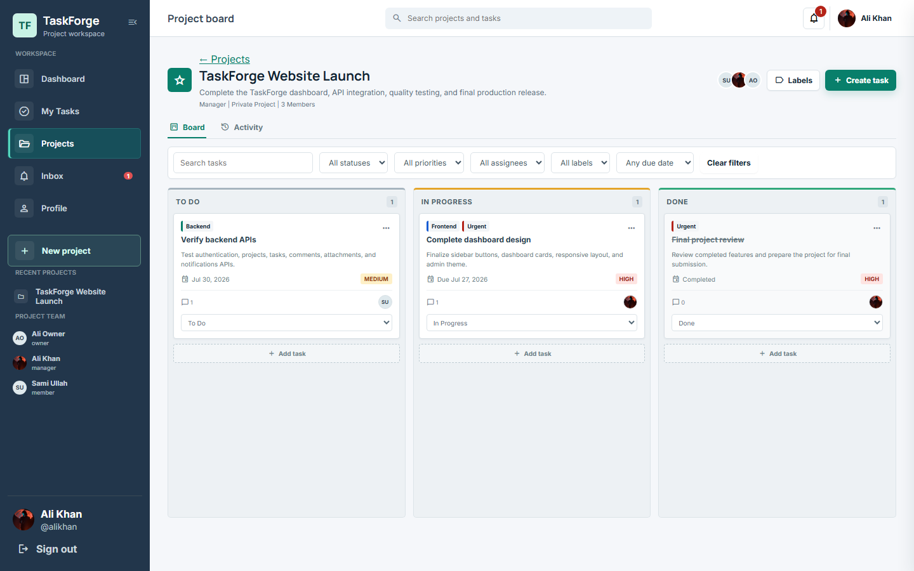

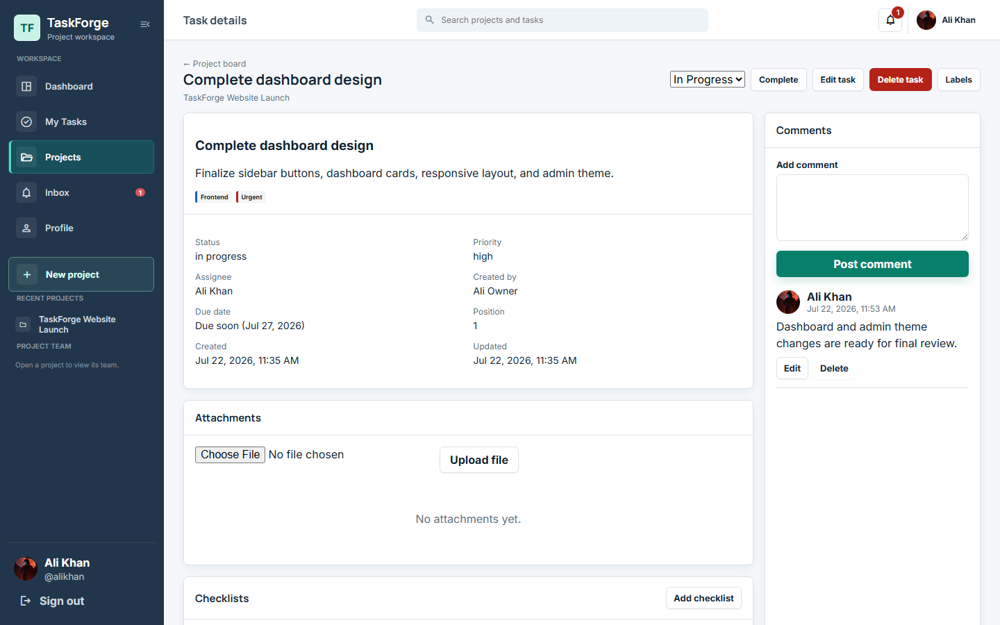

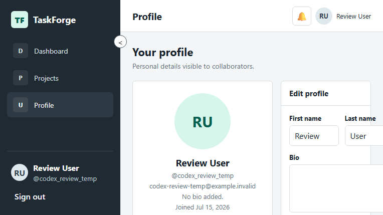

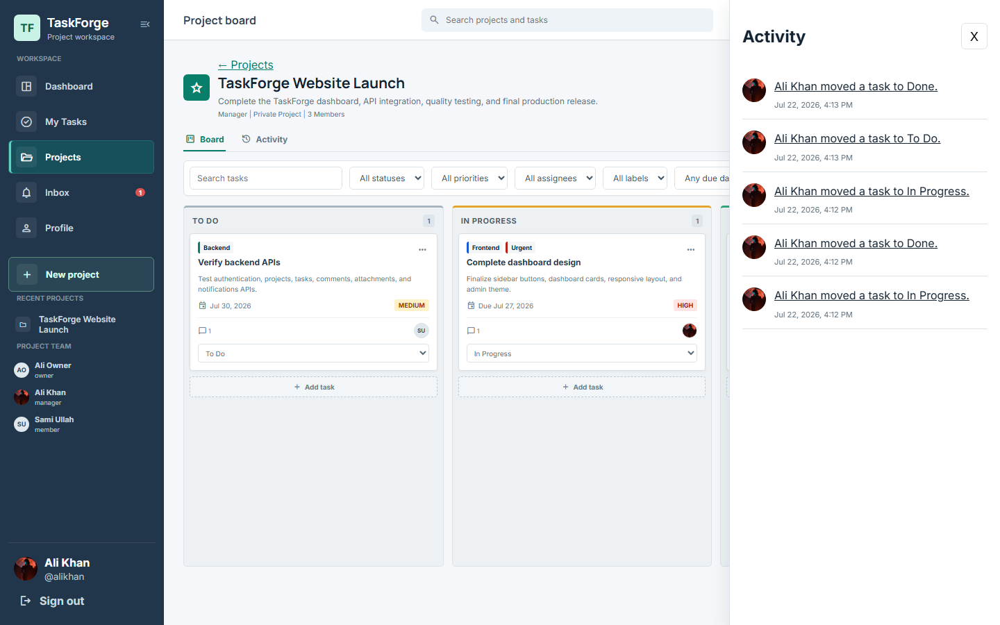

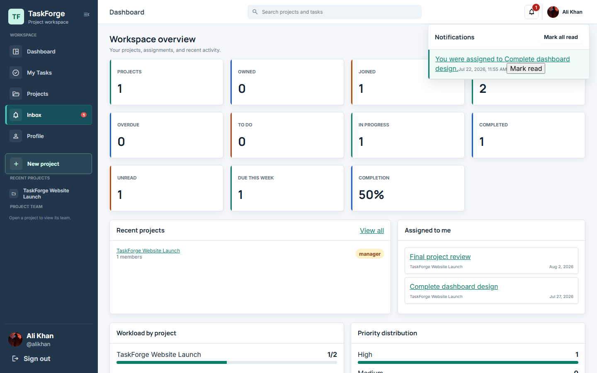

### Responsive Navigation

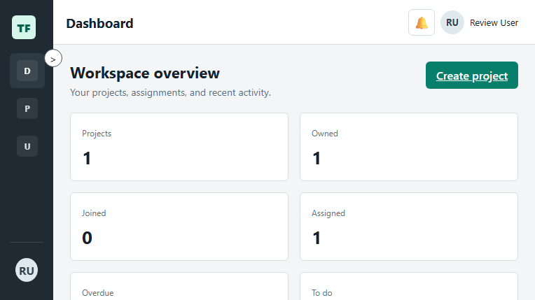

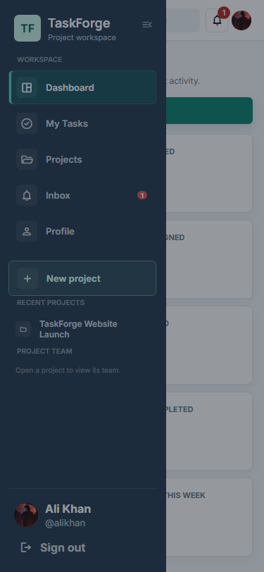

### Administration

The administration captures use the existing Sami administrator account. Password details are excluded from the profile capture.

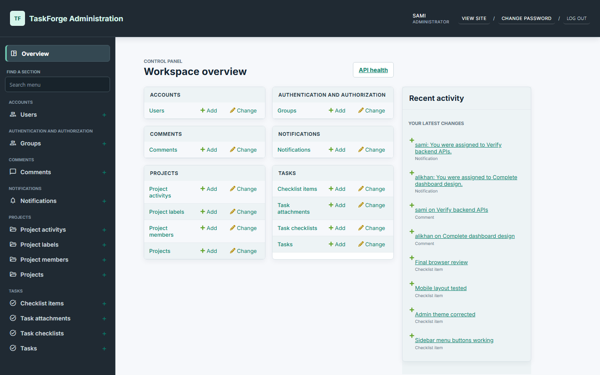

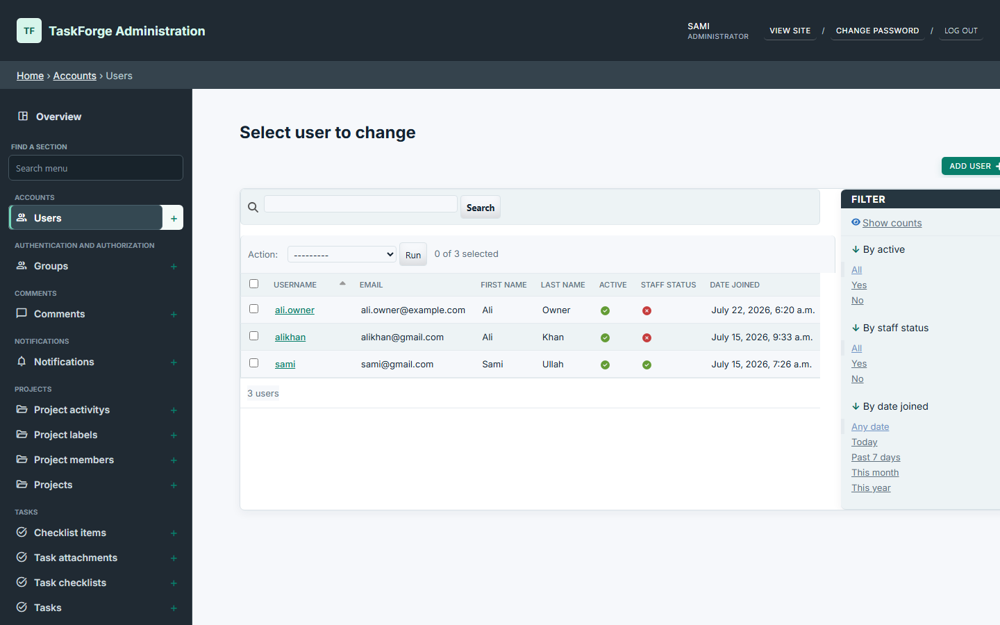

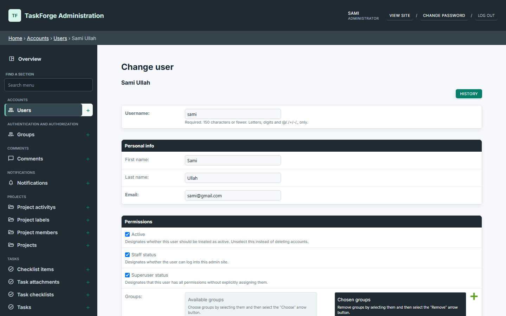

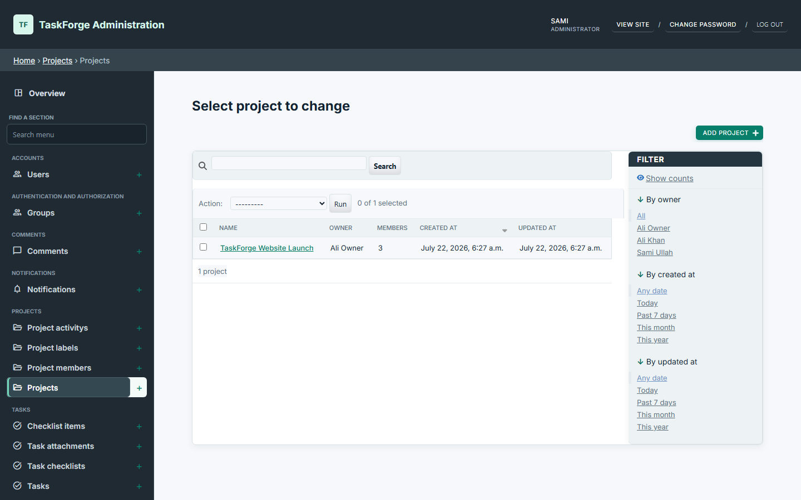

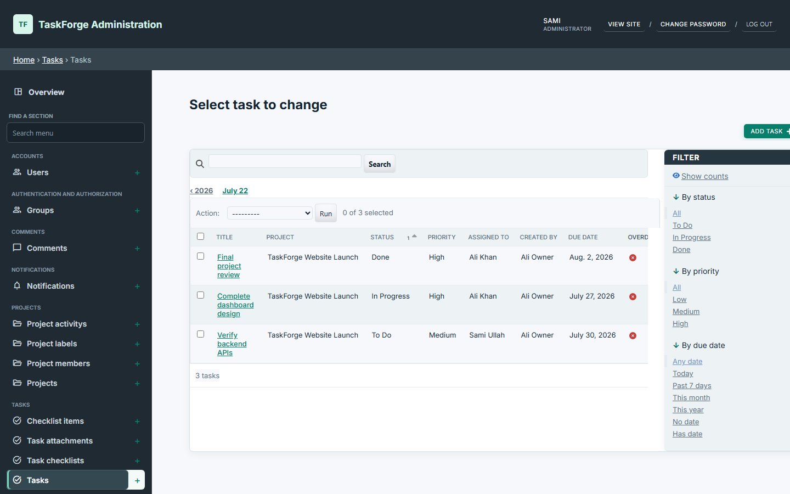

## 21. Git Workflow

Completed branches follow the feature sequence:

```text
feature/authentication
feature/projects
feature/tasks
feature/comments
feature/frontend
feature/notifications
chore/final-audit
feature/taskforge-enhancements
```

Inspect before committing:

```powershell
git status
git diff --check
python manage.py test
```

No remote push is performed automatically.

## 22. Author

- **Name:** SAMI ULLAH
- **GitHub:** `Sami-360`
- **Email:** `official.samiullah360@gmail.com`

## 23. License

TaskForge is available under the [MIT License](LICENSE).

## Professional Enhancements

TaskForge additionally includes validated UUID-based profile avatars, persistent desktop navigation, accessible mobile drawer behavior, locally branded Django admin, protected task attachments, task checklists, project labels, activity history, advanced search/filters, consistent due states, complete/reopen actions, dashboard insights, and repeat-safe due notifications.

The application shell uses the TaskForge teal, graphite, and neutral palette across the frontend and Django admin. Both interfaces include responsive side navigation, keyboard-visible focus states, active-page indicators, compact management panels, and real permission-aware navigation links.

Upload limits:

- Avatars: JPG/JPEG/PNG/WebP, maximum 5 MB
- Attachments: PNG/JPG/JPEG/WebP/PDF/TXT/DOC/DOCX/XLS/XLSX/ZIP, maximum 10 MB

Run reminder processing manually or through Windows Task Scheduler/cron:

```powershell
python manage.py send_due_task_notifications
```

New endpoint details and permissions are documented in [docs/api-documentation.md](docs/api-documentation.md). Authenticated screenshot capture steps are in [docs/screenshots/enhancement-screenshot-guide.md](docs/screenshots/enhancement-screenshot-guide.md).

## Known Production Limitations

- The current in-memory Channels layer works only in one application process. A multi-process deployment requires Redis or another shared channel layer.
- The repository contains development settings, not a hardened production settings module. Production deployment must set `DJANGO_DEBUG=False`, use a strong secret, restrict hosts and CORS origins, and terminate HTTPS at a reverse proxy or hosting platform.
- Django's development server and Python's static file server are local tools only. Production needs an ASGI server plus dedicated static and media serving.
- Uploaded media is stored on the local filesystem. Multi-instance or ephemeral hosting requires shared/object storage and a backup policy.
- Automated PostgreSQL backups, centralized logging, monitoring, and rate limiting are deployment responsibilities and are not configured in this repository.

## Troubleshooting

**`password authentication failed for user "postgres"`**: ensure the `.env` username/password match the credentials that work in pgAdmin. Restart the backend after editing `.env`.

**`database "taskforge" does not exist`**: create it through pgAdmin as described above.

**`No module named rest_framework`**: VS Code or the terminal is using global Python. Activate `.venv` and select `.venv\Scripts\python.exe`.

**HTTP 401**: refresh the access token through `/api/auth/token/refresh/`; invalid refresh tokens require signing in again.

**Frontend cannot call API**: confirm backend port `8000`, frontend port `5500`, and `CORS_ALLOWED_ORIGINS` values.

**WebSocket does not connect**: run the backend with the activated environment where Channels and Daphne are installed, and use `127.0.0.1` consistently.
